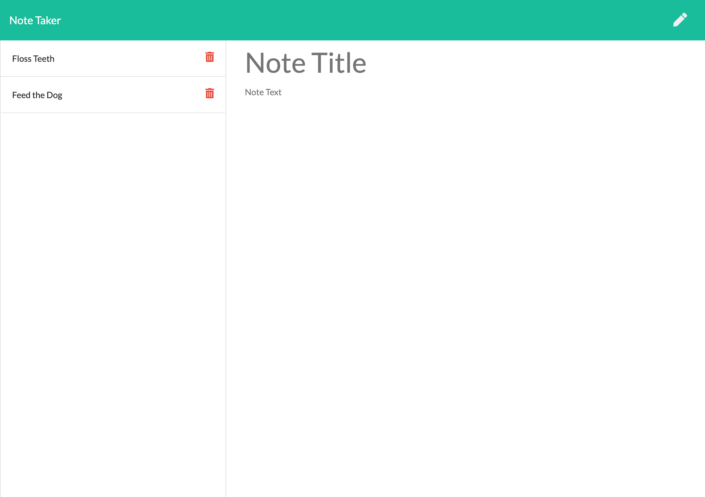

# Note Taker

The purpose of this project was to create an application that can be used to create and delete notes that can be accesed from any location.

The live application is deployed here: https://murmuring-chamber-38208.herokuapp.com/

## Application Functionality

The application is able to perform the following functions:

- New notes can be entered with a title and description text.
- Existing notes are listed on the left side of the screen and can be clicked to view their details.
- Notes are saved so that they can be accessed from any device at any location.
- Existing notes can be deleted from storage when they are no longer needed.

## Screenshot

This is a screenshot of the deployed application.

## References

- Bootstrap: https://getbootstrap.com/
- Express.js: https://expressjs.com/
